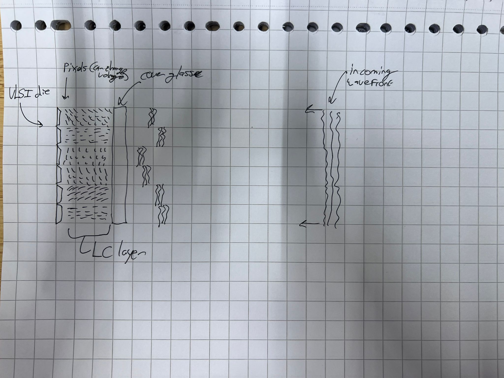

# Spatial Light Modulator
## What physical principle allows the SLM to modulate the light's phase (amplitude?)?
The SLM works through a liquid crystal display. This display consists of two layers, the cover glass and a VLSI die with reflexive pixels in an homogenous configuration. Between these two layers there is a nematic liquid crystal layer. The voltage applied to each pixel can be adjusted individualy through the VLSI backplane with 256 discrete steps. When the voltage of a pixel changes, the configuration of the liquid crystal layer in front of the pixel changes as well. When no voltage is applies, the liquid crystal layer molecules are allinged parallel to the two outer layers. With an increase in voltage, the molecules rotate such that they get more and more normal to the two outer layers - this behaviour is asymptotic, meaning with infinite voltage, the molecules will be completely parallel.

Crystals reflect light in two directions depending on the polerization and direction of the incoming light. There two angles are given by the _extraordinary_ ($n_e$) and _ordinary_ ($n_o$) refractive indixes. The oridnary index is constant while the molecules rotate - the extraordinary index variable. When the molecules are parallel to the plates, the extraordinary index is biggest, and dus the most different from the ordinary index. When the molecules are perpendicular to the plates, the extraordinary index is biggest, and gets extremely close to the ordinary index.

When the light that hits the liquid crystal layer is linearly polarised parallel to the extraordinary axis - in our case: vertically - the light experiences a phase shift. When no voltage is applied to the pixel, this phase shift will be a full wavelength. When the pixel is parallel to the incoming light, thus perpendicular to the outer layers, the light will experince a minimal phase shift.

## What are the strengths and limitations of using an SLM for light control?
The SLM is limited by the amount of pixels. Also it cannot perfectly angle the crystals such that the light has precisely no phase shift. Thirdly it is not possible to modulate the colors of different wavelength laserbeams at the sime time.
On the other hand the SLM can be very precise when calibrated correctly, and thus can be very usefull in wavefront shaping.

## What are the main components of a standard SLM?
See Q1.

## What techniques or steps are necessary to ensure the SLM works correctly?
It is crucial that the light that comes into the SLM is polarised vertically (parallel to the extraordinary axis), thus can be achieved by sending the beam trough a half-wave plate. If this is not the case the light will not be phase-shifted as expected (when the polarisation is perpendicular to the extraordinary axis, there will be no phase shift).
The phase shift is not linearly dependend on the voltage of the pixels, thus the SLM provides a LUT to convert the phase shift to a coresponding voltage. This LUT sometimes needs to be recalibrated, for examble when the wavelength of the laserbeam changes.

## Why do we care about polarization when using an SLM?
Because if the polarisation is not correct, the phase shift will not be as expected. It needs to be vertical in our case.

## How does phase modulation create a desired wavefront? (try sketching what a wavefront might look like before and after SLM modulation)
By changes the fase per pixel of the beam, we can create a patter that changes the output images after the fiber by constructive and destructive interference. 
